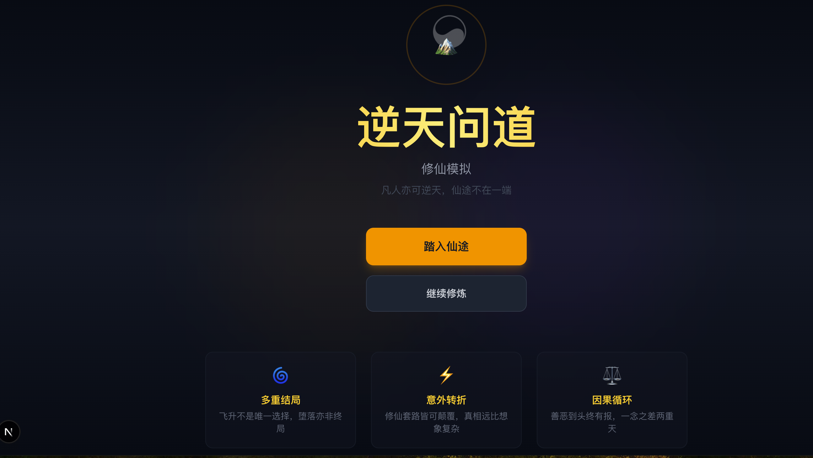
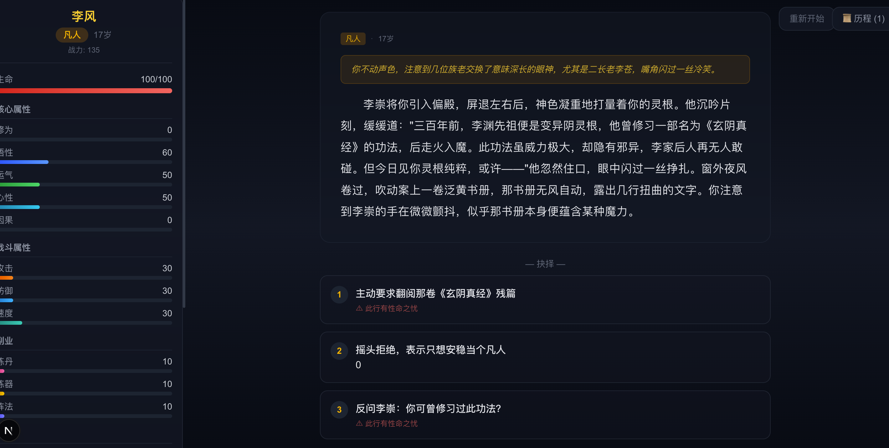

# 逆天问道 - 修仙模拟

参考《凡人修仙传》风格的修仙模拟网页游戏。LLM 驱动的动态剧情，不同的选择走向不同的道。





## 特色

- **LLM 动态剧情** — 每段故事由 AI 实时生成，没有固定脚本，每次游玩都是独一无二的体验
- **17 种结局** — 飞升不是唯一选择。开宗立派、返璞归真、坠入魔道、创世改天……甚至跳出天道棋盘
- **8 种灵根** — 金木水火土 + 混沌/天灵根/异变阴灵根，后三种颠覆传统设定
- **叙事+选择** — 不只是选择驱动，还有环境描写、人物志、群像心理、时间跳跃、世界事件等纯叙事章节
- **NPC 持久化** — 故事中的人物会被记住，关系会变化，剧情线会推进或过期
- **因果系统** — 善恶有报，一念之差可能导致截然不同的结局

## 快速开始

```bash
# 安装依赖
npm install

# 启动开发服务器
npm run dev
```

打开 http://localhost:3000 即可游玩。

## LLM 配置

游戏默认使用内置的备用故事（无需配置即可游玩）。配置 LLM 后可获得更丰富的动态剧情体验。

复制环境变量模板并填入你的 API 信息：

```bash
cp .env.example .env.local
```

编辑 `.env.local`：

```env
LLM_API_KEY=your-api-key
LLM_API_BASE=https://api.openai.com/v1
LLM_MODEL=gpt-3.5-turbo
```

支持任何 OpenAI 兼容的 API，例如：

| 服务商 | LLM_API_BASE | LLM_MODEL |
|--------|-------------|-----------|
| OpenAI | `https://api.openai.com/v1` | `gpt-4o-mini` |
| DeepSeek | `https://api.deepseek.com/v1` | `deepseek-chat` |
| 月之暗面 | `https://api.moonshot.cn/v1` | `moonshot-v1-8k` |
| 本地 Ollama | `http://localhost:11434/v1` | 你的模型名 |

也兼容 `OPENAI_API_KEY` / `OPENAI_API_BASE` 标准变量名。

## 修仙体系

### 境界（11 阶）

```
凡人 → 练气 → 筑基 → 结丹 → 元婴 → 化神 → 炼虚 → 合体 → 大乘 → 渡劫 → 真仙
```

### 灵根

| 灵根 | 特点 |
|------|------|
| 金灵根 | 刚猛凌厉，善攻伐 |
| 木灵根 | 生生不息，善炼丹 |
| 水灵根 | 灵活多变，善阵法 |
| 火灵根 | 暴烈霸道，善炼器 |
| 土灵根 | 厚重坚固，善防御 |
| 混沌灵根 | 五行皆杂，修炼极慢但潜力无穷 |
| 天灵根 | 单属性极致，修炼飞速但易遭天妒 |
| 异变阴灵根 | 修炼阴寒功法，走旁门左道 |

### 结局（5 大类）

- **超脱类** — 飞升成仙、开宗立派
- **变体类** — 逆天改命、返璞归真
- **沦落类** — 坠入魔道、魂飞魄散、傀儡仙
- **轮回类** — 轮回转世、无尽轮回
- **隐藏类** — 创世（篡改天道）、超脱（跳出体系）、旁观者（不修仙的史官）
- **特殊类** — 情道至尊、商道称尊、丹道圣手、芸芸众生

## 项目结构

```
src/
├── types/game.ts              # 核心类型定义
├── lib/
│   ├── gameEngine.ts          # 角色创建、属性计算、突破检测
│   ├── storyGenerator.ts      # LLM prompt 构建 + JSON 解析 + 备用故事
│   ├── endings.ts             # 17 种结局及触发条件
│   ├── achievements.ts        # 20 种成就（含 5 个隐藏成就）
│   └── useGame.ts             # 游戏状态管理（localStorage 持久化）
├── components/
│   ├── CharacterCreation.tsx  # 角色创建（随机灵根/出身）
│   ├── StatusPanel.tsx        # 角色状态面板
│   ├── StoryPanel.tsx         # 故事展示 + 选择/继续交互
│   ├── GameOver.tsx           # 结局展示
│   └── HistoryLog.tsx         # 历程回顾侧边栏
├── app/
│   ├── api/story/route.ts     # LLM 故事生成 API（3 次重试）
│   ├── page.tsx               # 主页面
│   ├── layout.tsx
│   └── globals.css
```

## 技术栈

- **Next.js 16** — React 全栈框架
- **TypeScript** — 类型安全
- **Tailwind CSS** — 样式
- **OpenAI Compatible API** — LLM 故事生成
- **localStorage** — 游戏存档

## License

MIT
